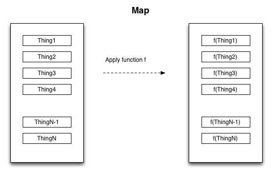
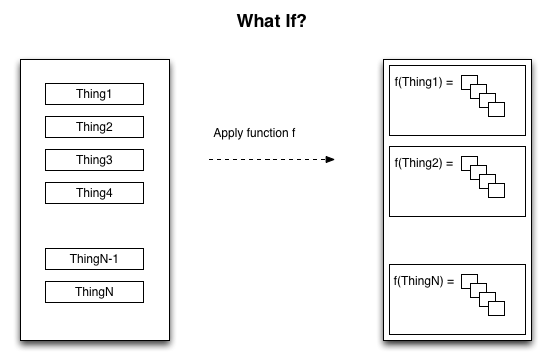

% Apache Spark Workshop
% Tetra Concepts  || Jailbreak Brewing Company.

# Workshop goals

* Work a data modeling problem with Spark (Dataframes and the basics of the RDD api).
* Learn some of Scala's cooler features (Collections api, regexes, a simple state machine).
* Leave feeling you are interested in learning more.

# Workshop non-goals

* Deploy and monitor Spark Applications
* Graphs
* MLlib (well... maybe if we have time)

# Overview of resources

* This presentation and "answers" to the "exercises" are available at
  [https://github.com/jt-halbert/spark-workshop/](https://github.com/jt-halbert/spark-workshop/).
* Thanks Markus!!
  [https://github.com/medale/spark-mail/](https://github.com/medale/spark-mail/)
* The data we will need is already in the ```tar``` you downloaded (or the VM).  It is a subset of the famous ENRON dataset.
    * [https://www.cs.cmu.edu/~./enron/](https://www.cs.cmu.edu/~./enron/)

# Who are we?

* I am Tetra's Chief Data Scientist and Spark is one of the tools I use to solve problems.
* Tetra Concepts is a group of talented engineers and scientists that...

# Why Apache Spark?

* Excellent question

# Data Science is a filthy job

* I am not even sure what Data Science is.  They put Science right in the name,
  so it must be pretty serious right?
* I like to think it is the disciplined application of a scientific mindset
  to that nebulous thing called "data."
* In my experience it is three activities

# The Three Big Things

1. Find a Problem.
2. Find a Solution.
3. Automate?

Be very careful about the order.

# Why Apache Spark?

* Spark gives you a way to explore small, medium, large, (very large ?) data in
  a convenient way.
    * You can actually explore distributed datasets: lazy evaluation and a rich
      collections api.
    * You can scale your exploratory code up to a full job relatively quickly:
      REPL driven development.
* It wraps an increasing amount of the Hadoop Ecosystem and plays naturally.

# Let's get started

* The first step is to learn enough Scala to be dangerous.

# Combinator functions on Scala collections

* Examples: map, flatMap, filter, reduce, fold, aggregate
* Background - Combinatory logic, higher-order functions...

# Combinatory Logic

Moses Schönfinkel and Haskell Curry in the 1920s

> [C]ombinator is a higher-order function that uses only function application and earlier defined combinators to define a result from its arguments [Combinatory Logic @wikipedia_combinatory_2014]

A *Higher-Order Function* is a function that takes functions as arguments or returns function.

# Functional Programming

* An approach/style of programming that deals with expressions and values rather than statements.
* Functions are treated (to the extent possible) as Mathematical Functions (no side effects, deterministic)

# map

* Applies a given function to every element of a collection
* Returns collection of outputs of that function
* input argument - same type as collection type
* return type - can be any type

#



# map - Scala
```scala
def computeLength(w: String): Int = w.length

val words = List("when", "shall", "we", "three",
  "meet", "again")
val lengths = words.map(computeLength)

> lengths  : List[Int] = List(4, 5, 2, 5, 4, 5)
```

# map - Scala syntactic sugar
```scala
//anonymous function (specifying input arg type)
val list2 = words.map((w: String) => w.length)


//let compiler infer arguments type
val list3 = words.map(w => w.length)


//use positionally matched argument
val list4 = words.map(_.length)
```

# map - ScalaDoc

See [immutable List ScalaDoc](http://www.scala-lang.org/api/2.10.4/index.html#scala.collection.immutable.List)
```scala
List[+A]
...
final def map[B](f: (A) => B): List[B]
```
* Builds a new collection by applying a function to all elements of this list.
* B - the element type of the returned collection.
* f - the function to apply to each element.
* returns - a new list resulting from applying the given function f to each
          element of this list and collecting the results.

#



#


# flatMap

* ScalaDoc:
```scala
List[+A]
...
def flatMap[B](f: (A) =>
           GenTraversableOnce[B]): List[B]
```

* [GenTraversableOnce](http://www.scala-lang.org/api/2.10.4/index.html#scala.collection.GenTraversableOnce) - List, Array, Option...

  * can be empty collection or None

* flatMap takes each element in the GenTraversableOnce and puts it in
order to output List[B]

  * removes inner nesting - flattens
  * output list can be smaller or empty (if intermediates were empty)


# flatMap Example
```scala
val macbeth = """When shall we three meet again?
|In thunder, lightning, or in rain?""".stripMargin
val macLines = macbeth.split("\n")
// macLines: Array[String] = Array(
//  When shall we three meet again?,
// In thunder, lightning, or in rain?)

//Non-word character split
val macWordsNested: Array[Array[String]] =
      macLines.map{line => line.split("""\W+""")}
//Array(Array(When, shall, we, three, meet, again),
//      Array(In, thunder, lightning, or, in, rain))

val macWords: Array[String] =
     macLines.flatMap{line => line.split("""\W+""")}
//Array(When, shall, we, three, meet, again, In,
//      thunder, lightning, or, in, rain)
```

# filter
```scala
List[+A]
...
def filter(p: (A) => Boolean): List[A]
```
* selects all elements of this list which satisfy a predicate.
* returns - a new list consisting of all elements of this list that satisfy the
          given predicate p. The order of the elements is preserved.

# filter Example
```scala
val macWordsLower = macWords.map{_.toLowerCase}
//Array(when, shall, we, three, meet, again, in, thunder,
//      lightning, or, in, rain)

val stopWords = List("in","it","let","no","or","the")
val withoutStopWords =
  macWordsLower.filter(word => !stopWords.contains(word))
// Array(when, shall, we, three, meet, again, thunder,
//       lightning, rain)
```

# reduce
```scala
List[+A]
...
def reduce[A1 >: A](op: (A1, A1) => A1): A1
```
* Creates one cumulative value using the specified associative binary operator.
* A1 - A type parameter for the binary operator, a supertype (super or same) of A.
(List is covariant +A)
* op - A binary operator that must be associative.
* returns - The result of applying op between all the elements if the list is nonempty.
Result is same type as (or supertype of) list type.
* UnsupportedOperationException if this list is empty.

#


# reduce Example
```scala
//beware of overflow if using default Int!
val numberOfAttachments: List[Long] =
  List(0, 3, 4, 1, 5)
val totalAttachments =
  numberOfAttachments.reduce((x, y) => x + y)
//Order unspecified/non-deterministic, but one
//execution could be:
//0 + 3 = 3, 3 + 4 = 7,
//7 + 1 = 8, 8 + 5 = 13

val emptyList: List[Long] = Nil
//UnsupportedOperationException
emptyList.reduce((x, y) => x + y)
```

# fold
```scala
List[+A]
...
def fold[A1 >: A](z: A1)(op: (A1, A1) => A1): A1
```
* Very similar to reduce but takes start value z (a neutral value, e.g.
  0 for addition, 1 for multiplication, Nil for list concatenation)
* returns start value z for empty list
* Note: See also foldLeft/Right (return completely different type)
```scala
 foldLeft[B](z: B)(f: (B, A) ⇒ B): B
```

# So what does this have to do with Apache Spark?

* Resilient Distributed Dataset ([RDD](https://spark.apache.org/docs/1.2.0/api/scala/#org.apache.spark.rdd.RDD))
* From API docs: "immutable, partitioned collection of elements that can be operated on in parallel"
* map, flatMap, filter, reduce, fold, aggregate...

# Spark - RDD API
* [RDD API](http://spark.apache.org/docs/1.2.0/api/scala/index.html#org.apache.spark.rdd.RDD)
* Transforms - map, flatMap, filter, reduce, fold, aggregate...

    * Lazy evaluation (not evaluated until action!)

* Actions - count, collect, first, take, saveAsTextFile...

# Spark - From RDD to PairRDDFunctions
* If an RDD contains tuples (K,V) - can apply PairRDDFunctions
* Uses implicit conversion of RDD to PairRDDFunctions
* Available by importing org.apache.spark.SparkContext._

# PairRDDFunctions

* keys, values - return RDD of keys/values
* mapValues - transform each value with a given function
* flatMapValues - flatMap each value (0, 1 or more output per value)
* groupByKey - RDD[(K, Iterable[V])]

    * Note: expensive for aggregation/sum - use reduce/aggregateByKey!

* reduceByKey - return same type as value type
* foldByKey - zero/neutral starting value
* aggregateByKey - can return different type
* join (left/rightOuterJoin), cogroup

# From RDD to DoubleRDDFunctions
* From API docs: "Extra functions available on RDDs of Doubles through an
  implicit conversion. Import org.apache.spark.SparkContext._ "

# DoubleRDDFunctions
* mean, stddev, stats (count, mean, stddev, min, max)
* sum
* histogram


# OK, time for puzzles

* Goal: build a Text Generator using a simple Markov Model.
    * Generate a corpus to work with (Dataframes)
    * Construct Tri-grams from that corpus (RDD API)
    * Use those to construct a Markov Model (RDD API)
    * Use the model to generate random sentences. (Cool Scala Tricks)

# Generate a Corpus (Dataframes)

* First, load the data:

```scala
val enronDF = sqlContext.read.json("./data/enron_small.json.gz")
```

* Next: who sent the most email?

```scala
val fromCounts = enronDF.groupBy("headers.From")
                        .count().sort(desc("count"))
val fromVinceDF = enronDF.where($"headers.From".startsWith("vince.ka"))
```


# Generate a Corpus (Dataframes)

* Find all the email bodies from Vince that contain mostly letters.
    * This is somewhat arbitrary, but it limits to emails without spreadsheets pasted into them.
* Hint: Use this (if you want)

```scala
def ratioLetters(s: String): Double = {
  val (tot, n) = s.replaceAll("""\s+""","")
                  .foldLeft((0.0, 0.0)) {
    (acc, c) => {
      (acc._1 + 1, acc._2 + (if (c.isLetter) 1 else 0))
    }
  }
  n/tot
}
```

# Generate a Corpus (Dataframes: User Defined Functions)

* Register the function and use it in SQL statements
```scala
sqlContext.udf.register("ratioLetters",(s:String) => ratioLetters(s))
fromVinceDF.registerTempTable("vinceEmails")
sqlContext.sql("SELECT payload, ratioLetters(payload) as ratioLetters FROM vinceEmails")
```
* Get only those emails that have a high ratio of Letters
```scala
val vinceTextDF = sqlContext.sql("SELECT payload FROM vinceEmails WHERE ratioLetters(payload) > 0.8")

```
* Note: this function doesn't work outside of SQL
```scala
fromVinceDF.select($"payload",ratioLetters($"payload")) //FAIL
```
* Need to
```scala
import org.apache.spark.sql.functions.udf
val ratioLettersUDF = udf(ratioLetters(_:String))
fromVinceDF.select($"payload",ratioLettersUDF($"payload"))
```

# Interactive investigation (RDD takeSample)

* Can we find just the text that belongs to Vince?
```scala
vinceTextDF.rdd.takeSample(false,10).foreach(println)
```
* Seems there are two natural breaks: "-------- Forwarded By" and his closer "Vince"
```scala
val upToForward = "---------------------- Forwarded by".r
val upToSig = ".*?\\s+(?=Vince)".r
val vinceText = vinceTextDF.rdd.map(_.getString(0)).map(_.replaceAll("\n"," "))
val corpus = vinceText.flatMap(s=>upToSig.findFirstIn(upToForward.split(s)(0)))
val sentenceSplitter = """(?<=[.\!\?])\s+(?=[A-Z])"""
val sentences = corpus.flatMap(_.split(sentenceSplitter))
sentences.cache
```

# Step 3

* Build an RDD of trigrams
    * e.g. "This is a simple sentence." becomes 
```scala
("","","This")
("","This","is")
("This","is","a")
("is","a","simple")
("a","simple","sentence.")
("simple","sentence.","")
("sentence.","","")
```
* Hint: 
```scala
 _.split("\\s+")
```
and
```scala
.sliding(3)
```

# Step 4 (Challenge)

* Build the model:
    * Reduce to ```RDD[(List[String],(String, Int))]``` of Antecedent Pair of Word followed by Consequent Word and count.

# Step 5 (Challenge)

* Build a Vince Sentence Generator.
* Hint:  Multinomial Sampler

```scala
def sampleMultinomial[T](dist: List[(T, Int)]): T = {
  val p = scala.util.Random.nextDouble*dist.map(_._2).sum
  def recur(acc: Int, d: List[(T, Int)]): T = d match {
    case (t,n) :: Nil => t
    case (t,n) :: ds  => if (acc + n >= p) t else {
      recur(acc+n,ds)
    }
  }
  recur(0,dist)
}
```
